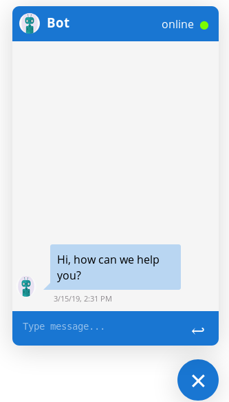

# Angular Chat Widget Rasa

This library was generated with [Angular CLI](https://github.com/angular/angular-cli) version 7.2.0.



## Prerequesites

A [Rasa](https://rasa.com/) bot exposed with the SocketIO protocol.

## Installation

Install `angular-chat-widget-rasa` from `npm`

```bash
npm i angular-chat-widget-rasa --save
```
Add the package to your module

```
import { ChatbotRasaModule } from 'angular-chat-widget-rasa';

@NgModule({
  imports: [ChatbotRasaModule]
})
```

## Usage

Add the component to your page

```
<chat-widget botName="MyBot" url="http://localhost:5002" ></chat-widget>
```

Inputs :

|Name|Type|Default|Description|
|:---:|:---:|:---:|:---:|
| theme | blue, grey or red | blue | The theme of the widget |
| botName | string | Bot | The name of the bot to display |
| botAvatar | url or path | https://cdn.dribbble.com/users/275794/screenshots/3128598/gbot_800.png | The avatar of the bot |
| userAvatar | url or path | https://storage.proboards.com/6172192/images/gKhXFw_5W0SD4nwuMev1.png | The avatar of the user |
| url | url  | http://localhost:5002 | The url to connect to the Rasa bot |
| startingMessage | string | Hi, how can we help you? | The message to display when the chat is open |
| opened | boolean | true | Set to true to open automaticaly when on the page or false to wait for a click |
